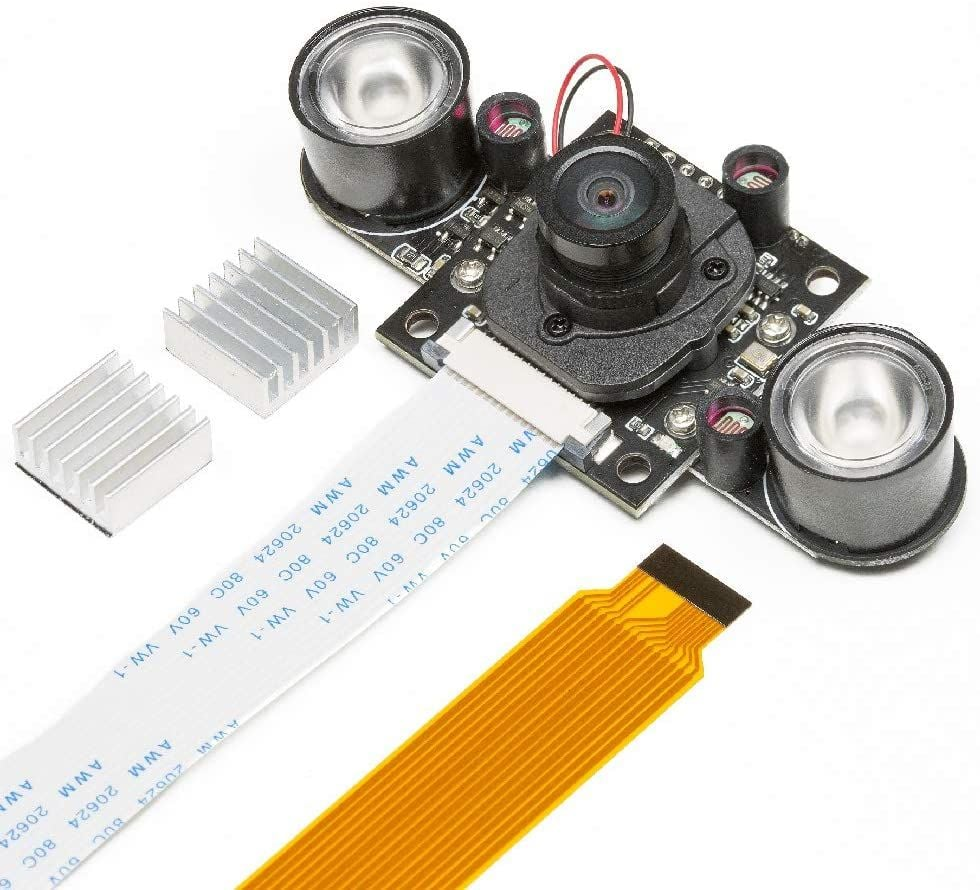

# How to Set Up Raspberry Pi 5 and Hailo AI Accelerator

In this guide, you will learn how to set up the Raspberry Pi 5 with a Hailo-8L AI accelerator in this project.

## Table of Contents
- [What You'll Need](#what-youll-need)
- [Hardware](#hardware)
- [Software](#software)

## What You'll Need
- Raspberry Pi 5 (8GB recommended)
- Raspberry Pi 5 AI KIT (option 1)
  - Raspberry Pi M.2 M-Key HAT
  - Hailo-8L M.2 M-Key module (Hailo-8 is also supported)
- Night Vision Raspberry Pi Camera
- Optional: Active Cooler for the Raspberry Pi 5
- Optional: Heat sink

## Hardware
For this project, we used the Raspberry Pi 5 model along with the official Active Cooler and a 27W USB-C Power Supply. We recommend using the official USB-C power supply to ensure the board can adequately power the M.2 HAT.


### Raspberry Pi M.2 M-Key HAT
The Raspberry Pi M.2 M-Key HAT can be used with the Hailo-8L M.2 key M or B+M. (Hailo-8 is also supported). When installing the M.2 module, make sure to use the thermal pad to ensure proper heat dissipation between the M.2 module and the HAT. For detailed instructions on how to install the M.2 module, follow [Raspberry Pi's official AI Kit Guide](https://www.raspberrypi.com/documentation/accessories/ai-kit.html#ai-kit).


### Raspberry Pi Camera
In this project, we use the Raspberry Pi Camera 5MP OV5647 Lensa Wide Angle +IR Night Vision Light.



## Software
### Install Raspberry Pi OS Camera Library
For using the Raspberry Pi Camera, Raspberry Pi OS provides a package called `picamera` to interact with the camera module. This is a Python binding for controlling the camera.

#### Update System Packages
Before installing the camera library, it's important to make sure that your system packages are up to date and the system use the recent kernel. Run the following commands:

```bash
sudo apt update
sudo apt upgrade
```

#### Install the `picamera` Library
The official Raspberry Pi Camera library is called picamera, and it allows you to interface with the Raspberry Pi Camera from Python.
```bash
sudo apt install python3-picamera2
```

#### Enable Camera Interface (if not already enabled)
Before you can use the camera module, you need to make sure that the camera interface is enabled on the Raspberry Pi. This can be configured in the Raspberry Pi Configuration menu. We can do this by opening the Taspberry Pi Configuration tool
```bash
sudo raspi-config
```

Navigate to Interfacing Options > Camera, then select Yes to enable the camera.

Once you've enabled it, reboot your Raspberry Pi. And that's it! For further documentation, see their [official github](https://github.com/raspberrypi/picamera2) for the installation.


#### Using the GPIO Pin of Raspberry Pi 5
So, to be able to use the IO Pins that Raspberry Pi 5 have, we have to do some extra steps. If you try for now currently using the `RPi.GPIO`, the RPi.GPIO doesn't support the Raspberry Pi 5, so we have to do some hacks to be able to use them, especially using them through Python code. This has been discussed [here](https://github.com/gpiozero/gpiozero/issues/1172). To use them, we can use the alternative, which is the [gpiozero](https://gpiozero.readthedocs.io/en/stable/index.html) package. The steps to install and use them in Python are explained [here](https://raspberrypi.stackexchange.com/questions/40105/access-gpio-pins-without-root-no-access-to-dev-mem-try-running-as-root). We can do this by

```bash
sudo rpi-update
```

and then install gpiozero and lgpio dependencies
```bash
sudo apt install python3-gpiozero python3-lgpio
```

if it's still not working, maybe make sure you are a member of the gpio group. But do this as the last resort
```bash
sudo adduser pi gpio
```

### Install Hailo Software
The most easiest way to installing the package needed to run the Hailo is by following the instructions on [Raspberry Pi's official AI Software Guide](https://www.raspberrypi.com/documentation/computers/ai.html#getting-started). This is by running the following command from a terminal window:

```bash
sudo apt install hailo-all
```

This will install the following software components, scotts free from hassle:
- Hailo firmware
- HailoRT runtime software. See [HailoRT GitHub Repo](https://github.com/hailo-ai/hailort) for more information.
- Hailo TAPPAS Core package: A derivative of the TAPPAS repository, this core package includes GStreamer elements, post-processing functions, and additional tools used by this repository. It is essential for developing applications on the Pi but does not include standalone applications. See [Hailo TAPPAS GitHub](https://github.com/hailo-ai/tappas) for more information and documentation.
- The `rpicam-apps` Hailo post-processing software demo stages. See [Raspberry Pi Official Examples](../README.md#raspberry-pi-official-examples) for more information.

### Set PCIe to Gen3
To achieve optimal performance from the Hailo device, it is necessary to set PCIe to Gen3. While using Gen2 is an option, it will result in lower performance.
The Hailo AI HAT is auto detected as Gen3, but because we are using the M.2 HAT, we will need to set it manually.
Open the Raspberry Pi configuration tool:
```bash
sudo raspi-config
```
Select option "6 Advanced Options", then select option "A8 PCIe Speed". Choose "Yes" to enable PCIe Gen 3 mode. Click "Finish" to exit.

##### Reboot your Raspberry Pi.
```bash
sudo reboot
```

### Verify Installation
Now you can check if the Hailo chip is recognized by the system:
```bash
hailortcli fw-control identify
```
If everything is OK, it should output something like this:
```bash
Executing on device: 0000:01:00.0
Identifying board
Control Protocol Version: 2
Firmware Version: 4.17.0 (release,app,extended context switch buffer)
Logger Version: 0
Board Name: Hailo-8
Device Architecture: HAILO8L
Serial Number: N/A
Part Number: N/A
Product Name: N/A
```
Getting N/A for Serial Number, Part Number, and Product Name is normal for the AI HAT.